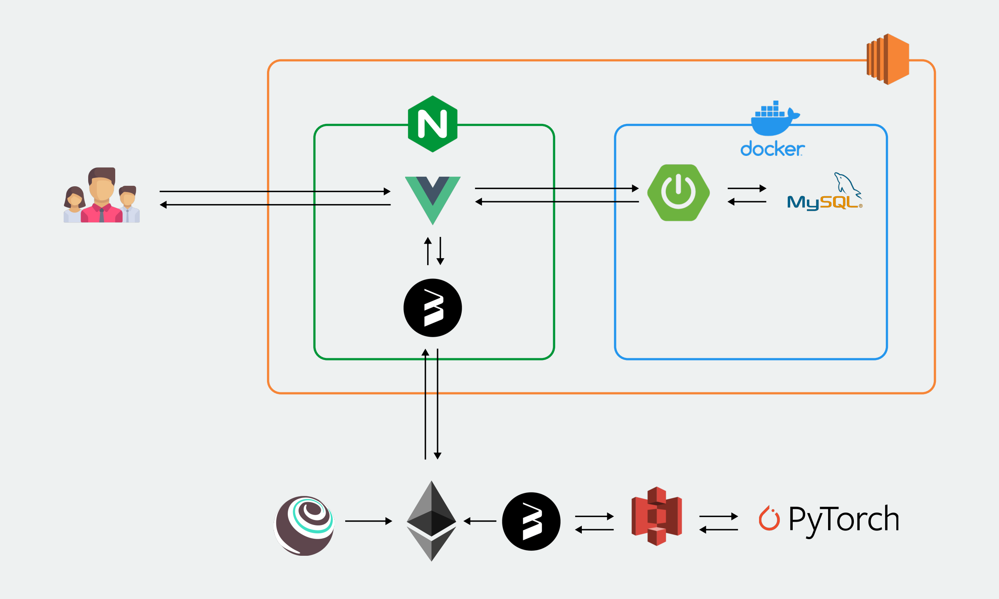
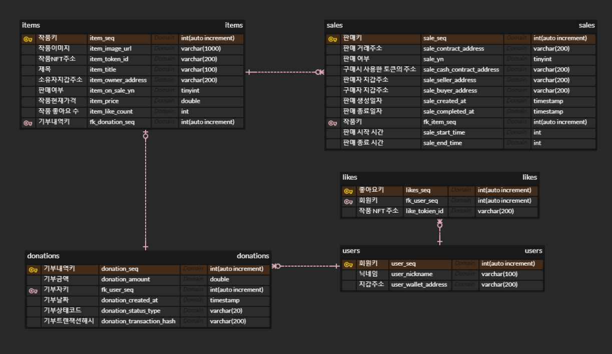

  <h1>핸드 투 핸드 (Hand to Hand)</h1>
   

## 목차

1. [**서비스 소개**](#서비스-소개)
1. [**개발 기간**](#개발-기간)
1. [**주요 기능**](#3)
1. [**프로젝트 구성도**](#4)
1. [**담당 역할**](#6)

 

## 💁 서비스 소개

**핸드 투 핸드 (Hand to Hand)** 는 우크라이나 기부를 독려하기 위한 프로젝트입니다.

1. 우크라이나 정부에 암호화폐를 기부할 수 있습니다.
2. 암호화폐를 기부하면 AI가 그린 우크라이나 풍경화 NFT를 받을 수 있습니다.
3. 리워드로 받은 NFT를 판매, 입찰, 구매할 수 있습니다.

 

## 📅 개발 기간

22.02.21. ~ 22.04.08 (7주)

 

## 💡 주요 기능

| 기능           | 내용                                                                  |
| :------------- | :-------------------------------------------------------------------- |
| 지갑 연결      | 개인 키를 입력하여 지갑을 연결할 수 있습니다.                         |
| 기부           | 연결된 지갑의 잔액을 조회하고, 잔액 미만의 금액을 기부할 수 있습니다. |
| 기부 내역 확인 | 나의 기부 내역을 확인할 수 있습니다.                                  |
| NFT 발급       | 나의 기부 내역에서 NFT를 발급 받을 수 있습니다.                       |
| NFT 조회       | 다른 사람들의 NFT, 내가 보유한 NFT를 조회할 수 있습니다.              |
| NFT 거래       | NFT를 판매, 입찰, 구매할 수 있습니다.                                 |

 

## 🛠 기술 스택

### **Front-end**

|  |  |  |
| :----------------------------------------------------------------------------------------------------------------------------: | :--------------------------------------------------------------------------------------------------------------------------: | :-----------------------------------------------------------------------------------------------------------------------------: |
|                                                             HTML5                                                              |                                                             CSS3                                                             |                                                           javascript                                                            |

|  |  |  |  |
| :-------------------------------------------------------------------------------------------------------------------------------: | :-----------------------------------------------------------------------------------------------------------------------------------------------------: | :-------------------------------------------------------------------------------------------------------------------------: | :----------------------------------------------------------------------------------------------------------------------: |
|                                                                Vue                                                                |                                                                          Vuex                                                                           |                                                           web3.js                                                           |                                                        Bootstrap                                                         |

### **Blockchain**

|  |
| :---------------------------------------------------------------------------------------------: |
|                                           truffle.js                                            |

### **AI**

|  |
| :-------------------------------------------------------------------------------------------------------: |
|                                                  PyTorch                                                  |

### **Back-end**

|  |  |  |
| :--------------------------------------------------------------------------------------------------------------------------: | :---------------------------------------------------------------------------------------------------------------------------------------------: | :----------------------------------------------------------------------------------------------------------------------------: |
|                                                             Java                                                             |                                                                   Spring-Boot                                                                   |                                                             MySQL                                                              |

### **DevOps**

|  |  |  |
| :-------------------------------------------------------------------------------------------------------------------: | :------------------------------------------------------------------------------------------------------------------------------: | :------------------------------------------------------------------------------------------------------------------------------: |
|                                                         NGiNX                                                         |                                                               aws                                                                |                                                              docker                                                              |

 

## 📂 프로젝트 구성도

|                                   아키텍처(Architecture)                                   |
| :----------------------------------------------------------------------------------------: |
|  |

|                              개체-관계 모델(ERD)                               |
| :----------------------------------------------------------------------------: |
|  |

 

## 👪 담당 역할

<table width="100%">
  <tr>
    <td align="center">Frontend</td>
    <td>
      A. 메인페이지 개발  
      - 지갑 연결 기능  
      - 잔액 확인 및 송금 기능  
       
      B. 마이페이지 개발  
      - 송금 내역 조회 기능  
      - NFT 발급 기능  
       
      C. NFT 갤러리 페이지 개발  
      - NFT 목록 조회 기능  
       
      C. 주요 모듈 개발  
      - API 호출 함수 개발  
      - Vuex, Router 개발  
    </td>
  </tr>
  <tr>
    <td align="center">BlockChain</td>
    <td>
      A. web3.js를 사용한 주요 모듈 개발  
      - 트랜잭션 처리 모듈 개발  
      - 스마트 컨트랙트 호출 함수 개발  
    </td>
  </tr>
  <tr>
    <td align="center">DevOps</td>
    <td>
      A. Frontend, Backend 도커라이징  
      - Frontend의 경우 멀티 스테이지 빌드를 통해 이미지 경량화  
       
      B. Nginx를 사용해 배포  
        - FE, BE 컨테이너를 외부에 바로 노출하지 않고 Nginx를 Reverse proxy로 사용
    </td>
  </tr>
</table>
